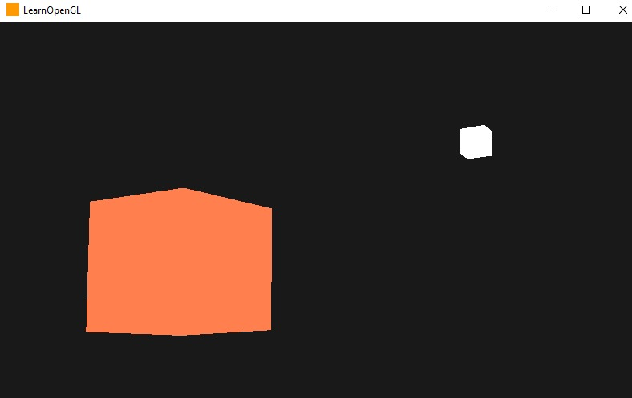
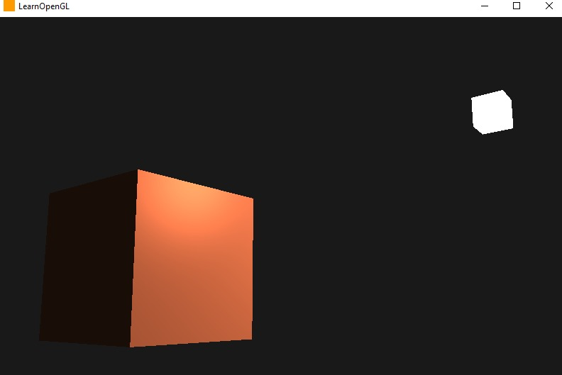
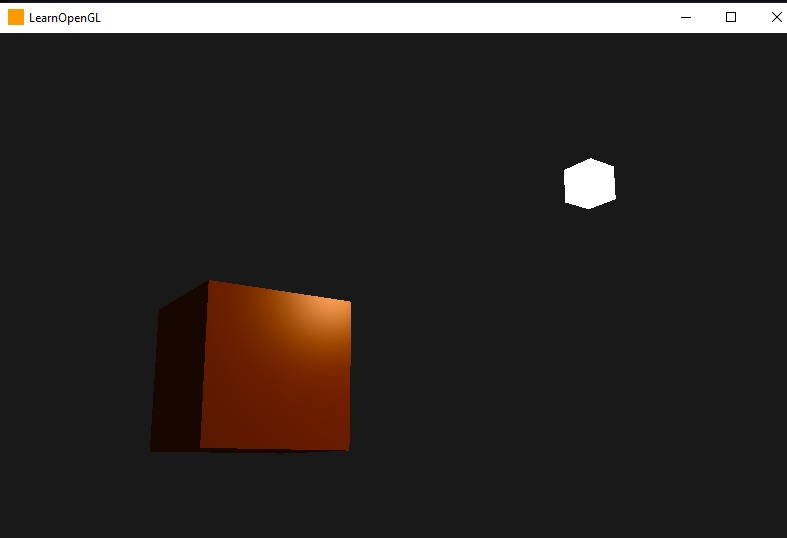
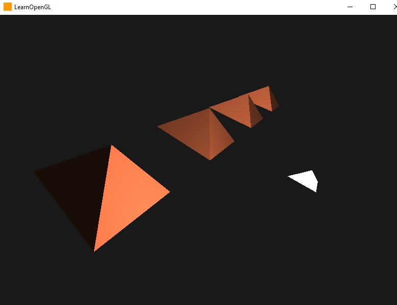
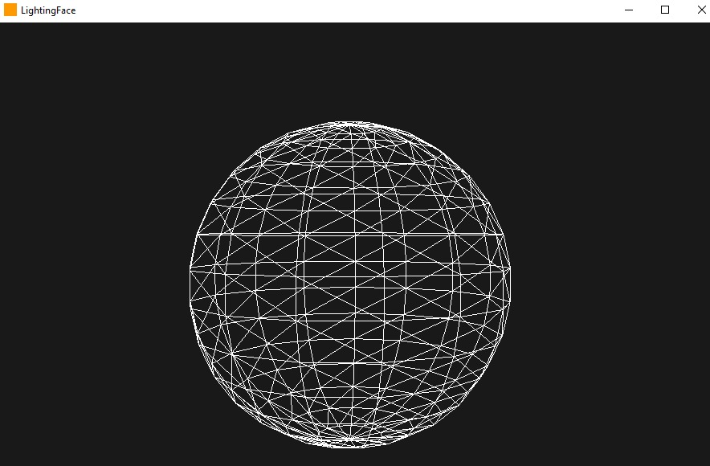

# Iluminación LEARNOPENGL
En este proyecto se implementa y ejecuta los 3 capitulos iniciales de Iluminación de LearnOpenGl.
Como plus de nota, implementé 2 codigos; se incluye el cambio de forma de iluminación para piramides y la creación de una esfera.
# Piramides

En este proyecto se implementa la representación de tres pirámides con iluminación utilizando OpenGL. Las pirámides son objetos tridimensionales con una base cuadrada y caras triangulares que convergen en un vértice común en la parte superior. La iluminación se utiliza para simular cómo la luz interactúa con las superficies de las pirámides, generando efectos de sombra y realismo.

## Clase Shader

La clase `Shader` se encarga de compilar y enlazar los shaders utilizados en el proyecto. Los shaders son programas especiales que se ejecutan en la tarjeta gráfica y controlan la apariencia y el comportamiento de los objetos en OpenGL.

La clase `Shader` recibe como parámetros los paths de los archivos que contienen el código fuente de los shaders de vértices y fragmentos. Estos shaders son escritos en un lenguaje llamado GLSL (OpenGL Shading Language).

Cuando se crea un objeto `Shader`, se leen los archivos de los shaders y se compilan individualmente. Luego, se crea un programa de shader que enlaza los shaders compilados. Este programa es utilizado para renderizar los objetos en el proyecto.

Además, la clase `Shader` proporciona métodos para configurar los valores de las variables uniformes en los shaders. Las variables uniformes son variables que se mantienen constantes durante una llamada a un shader. Estas variables se utilizan para pasar información desde la aplicación a los shaders, como las matrices de transformación, los vectores de posición y los colores de los objetos.

## Clase Camera

La clase `Camera` representa una cámara virtual que se utiliza para visualizar la escena en OpenGL. La cámara tiene una posición en el espacio tridimensional y puede ser movida y rotada por el usuario.

La clase `Camera` almacena información sobre la posición, la orientación y las opciones de la cámara, como la velocidad de movimiento y la sensibilidad del mouse.

Para calcular la matriz de vista de la cámara, se utiliza la función `glm::lookAt()`, que toma la posición de la cámara, el punto al que está mirando y el vector que indica hacia arriba. La matriz de vista se utiliza para transformar las coordenadas de los objetos de la escena al espacio de la cámara.

La clase `Camera` proporciona métodos para procesar la entrada del usuario y actualizar la posición y la orientación de la cámara en respuesta a esta entrada. Estos métodos permiten mover la cámara hacia adelante y hacia atrás, hacia la izquierda y hacia la derecha, y rotarla hacia arriba y hacia abajo.

Funciones y constantes adicionales

- `PI`: Constante que almacena el valor de Pi, utilizado para cálculos trigonométricos.
- `TAU`: Constante que almacena el valor de Tau, que es el doble de Pi. También se utiliza en cálculos trigonométricos.
- `Camera_Movement`: Enumeración que define las posibles direcciones de movimiento de la cámara, como hacia adelante, hacia atrás, hacia la izquierda y hacia la derecha.
- `YAW`: Valor predeterminado para el ángulo de giro horizontal de la cámara. Controla la dirección en la que la cámara está mirando horizontalmente.
- `PITCH`: Valor predeterminado para el ángulo de giro vertical de la cámaraControla la dirección en la que la cámara está mirando verticalmente.
- `SPEED`: Velocidad de movimiento de la cámara. Determina qué tan rápido se desplaza la cámara en respuesta a la entrada del usuario.
- `SENSITIVITY`: Sensibilidad del mouse para el movimiento de la cámara. Controla qué tan rápido responde la cámara a los movimientos del mouse.
- `ZOOM`: Valor de zoom de la cámara. Determina el nivel de acercamiento o alejamiento de la vista de la cámara.

En el código restante, se implementa la funcionalidad de las clases `Shader` y `Camera`, junto con otras funciones auxiliares para el procesamiento de los shaders y la configuración de la cámara.

# Esfera
En este código se implementa la generación de una esfera en OpenGL utilizando la clase `Sphere`. La esfera se crea dividiendo su superficie en segmentos horizontales y verticales y generando los vértices y los índices necesarios para definir su geometría.

## Clase `Sphere`

La clase `Sphere` tiene los siguientes atributos:

- `VAO`: Identificador del objeto de arreglo de vértices (Vertex Array Object).
- `VBO`: Identificador del objeto de búfer de vértices (Vertex Buffer Object).
- `EBO`: Identificador del objeto de búfer de índices (Element Buffer Object).
- `vertices`: Vector que almacena los vértices de la esfera.
- `Indices`: Vector que almacena los índices de los vértices para definir las caras de la esfera.

## Constructor de la clase `Sphere`

El constructor de la clase `Sphere` recibe dos parámetros: `xSegments` y `ySegments`, que determinan el número de segmentos horizontales y verticales de la esfera, respectivamente. En el constructor, se generan los vértices y los índices de la esfera utilizando fórmulas matemáticas.

## Generación de los vértices

La generación de los vértices se realiza mediante un bucle anidado que recorre los segmentos horizontales y verticales. Para cada segmento, se calcula la posición de un vértice en coordenadas esféricas y se convierte a coordenadas cartesianas. Luego, se crean los objetos `Vertex` correspondientes, que contienen la posición, la normal y las coordenadas de textura del vértice, y se agregan al vector `vertices`.

## Generación de los índices

La generación de los índices se realiza mediante otro bucle anidado que recorre los segmentos horizontales y verticales y crea los índices para las caras de la esfera. Se utilizan índices para definir los triángulos que forman las caras, especificando los vértices que forman cada triángulo.

## Configuración de los objetos de búfer y los atributos de los vértices

Después de generar los vértices y los índices, se llama al método `setupSphere()` para configurar los objetos de búfer y los atributos de los vértices en OpenGL. En este método, se generan y enlazan los objetos de búfer, se cargan los datos de los vértices y los índices en los búferes correspondientes, y se configuran los atributos de los vértices.

## Dibujo de la esfera

Para dibujar la esfera en OpenGL, se llama al método `Draw()`. En este método, se activa la textura, se establece el modo de representación (en este caso, se utiliza `GL_LINE` para dibujar las aristas de los triángulos), se enlaza el objeto de arreglo de vértices, y se llama a la función `glDrawElements()` para dibujar los triángulos utilizando los índices.

Siempre es una buena práctica restablecer los valores predeterminados una vez que se ha configurado todo.

---
# Imagenes
## Iluminacion 1

## Iluminacion 2

## Iluminacion 3

## Piramides

## Esfera

