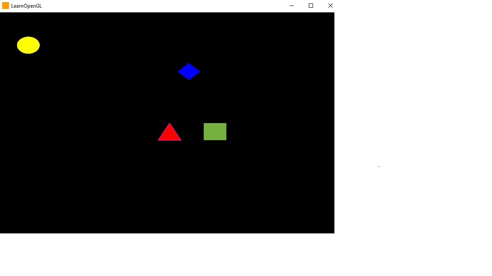

# OpenGL Mover Figuras
Este proyecto utiliza OpenGL para renderizar figuras geométricas y aplicarles transformaciones de rotación, traslación y escala utilizando matrices.

## Requisitos
* GLAD
* GLFW
* C++11
## Matrices.h

Esta función proporciona operaciones de matrices para rotación, traslación y escala de figuras en un espacio tridimensional.

### Uso

Incluye el archivo de encabezado `matrices.h` en tu código fuente para acceder a las funciones y estructuras proporcionadas.

```cpp
#include <iostream>
#include <vector>
#include <cmath>
#include "matrices.h"

// Código de ejemplo
int main() {
    // Crear una matriz de rotación en el eje x
    Matriz matrizRotacionX;
    matrizRotacionX.convert_matrix_rotation_x(45.0);

    // Crear una matriz de traslación
    Matriz matrizTraslacion;
    matrizTraslacion.create_matrix_point({1.0, 2.0, 3.0});

    // Crear una matriz de escala
    Matriz matrizEscala;
    matrizEscala.convert_matrix_scale(2.0, 2.0, 2.0);

    // Multiplicar matrices
    Matriz resultado;
    Multiply(matrizRotacionX, matrizTraslacion, resultado);
    Multiply(resultado, matrizEscala, resultado);

    // Imprimir la matriz resultante
    resultado.print_matrix();

    return 0;
}
```
### Funciones disponibles
#### Matriz
* Matriz(int x_size = 4, int y_size = 4): Constructor que crea una matriz de tamaño x_size x y_size.

* Matriz(vector<float>& data_tempo): Constructor que crea una matriz a partir de un vector de datos.

* void convert_matrix_identity(int size): Convierte la matriz en una matriz identidad de tamaño size.

* void transpose_matrix(matrix_type& matrix): Transpone la matriz dada.

* matrix_type inverse_rotation_matrix_x(float angle): Calcula la matriz de rotación inversa en el eje x con el ángulo especificado.

* matrix_type inverse_rotation_matrix_y(float angle): Calcula la matriz de rotación inversa en el eje y con el ángulo especificado.

* matrix_type inverse_rotation_matrix_z(float angle): Calcula la matriz de rotación inversa en el eje z con el ángulo especificado.

* matrix_type inverse_translation_matrix(float x, float y, float z): Calcula la matriz de traslación inversa con los valores de desplazamiento especificados.

* matrix_type inverse_scale_matrix(float x, float y, float z): Calcula la matriz de escala inversa con los factores de escala especificados.

* void convert_matrix_rotation_origin(float angle): Convierte la matriz en una matriz de rotación en el origen con el ángulo especificado.

* void convert_matrix_rotation_x(float angle): Convierte la matriz en una matriz de rotación en el eje x con el ángulo especificado.

* void convert_matrix_rotation_y(float angle): Convierte la matriz en una matriz de rotación en el eje y con el ángulo especificado.

* void convert_matrix_rotation_z(float angle): Convierte la matriz en una matriz de rotación en el eje z con el ángulo especificado.

* void convert_matrix_rotation_eje(float angle): Convierte la matriz en una matriz de rotación en un eje arbitrario.
  
  
## polygono.h
polygono.h es un archivo de encabezado que proporciona una estructura y funciones para trabajar con polígonos en una aplicación gráfica.

### Dependencias
GLFW library (#include <GLFW/glfw3.h>)
Vector library (#include <vector>)
Math library (#include <cmath>)
Input/output stream library (#include <iostream>)
UNIX standard library (#include <unistd.h>)
"Matrices.h" header file
  
### Structure: Polygono
La estructura Polygono representa un polígono y proporciona los siguientes miembros:

#### Member Variables
* vertices: Un vector de números en punto flotante que representa los vértices del polígono.
* directions: Un vector de números en punto flotante que representa las direcciones del polígono.
* polygon_color_R: El componente rojo del color del polígono.
* polygon_color_G: El componente verde del color del polígono.
* polygon_color_B: El componente azul del color del polígono.
* vel: La velocidad del polígono.
  
#### Constructors
- Polygono(vector<float> temp_vertices, float R, float G, float B): Construye un objeto Polygono con los vértices y el color especificados.
  
#### Methods
* void cambiarcolor(float R, float G, float B): Cambia el color del polígono.
* void draw(GLFWwindow* window, bool wired = false): Dibuja el polígono en la ventana GLFW especificada.
* void drawLine(GLFWwindow* window, bool wired = true): Dibuja el polígono como un bucle de líneas en la ventana GLFW especificada.
* void drawPoint(GLFWwindow* window): Dibuja el polígono como puntos en la ventana GLFW especificada.
* vector<float> get_min_max_x(): Devuelve un vector que contiene las coordenadas x mínima y máxima del polígono.
* vector<float> get_min_max_y(): Devuelve un vector que contiene las coordenadas y mínima y máxima del polígono.
* void trans(float new_x, float new_y, float new_z): Realiza una traslación del polígono según las cantidades especificadas en las direcciones x, y y z.
* void pro_traslate(vector<float> point): Realiza una traslación del polígono basada en un punto dado.
* void pro_rotation_x(float angle): Rota el polígono alrededor del eje x por el ángulo especificado.
* void pro_rotation_y(float angle): Rota el polígono alrededor del eje y por el ángulo especificado.
* void pro_rotation_z(float angle): Rota el polígono alrededor del eje z por el ángulo especificado.
* void escalao(float x, float y, float z): Escala el polígono según los factores especificados en las direcciones x, y y z.
* void escalaomas(): Aumenta la escala del polígono.
* void escalaomenos(): Reduce la escala del polígono.
* void print_position(): Imprime la posición de cada vértice del polígono.

#### Uso
Para dibujar solo debes llamar :
```cpp
#include <GLFW/glfw3.h>
#include <vector>
#include <cmath>
#include <iostream>
#include <unistd.h>
#include "Matrices.h"
  .
  .
  .
  .
  
  poligono.draw(ventana);
```


## Instrucciones de compilación
* Asegúrate de tener las bibliotecas necesarias instaladas en tu sistema.
* Clona el repositorio o descarga los archivos del proyecto.
* Configura tu entorno de desarrollo para compilar el código C++.
* Copia y pega el código fuente proporcionado en un archivo fuente C++ (por ejemplo, main.cpp).
* Compila el código fuente dado, usando _SET_PATHS_ y _GENERATE...
## Uso
El programa permite interactuar con diferentes figuras geométricas y aplicar transformaciones a ellas mediante las siguientes teclas:

* E: Cambiar el color de la estrella.
* C: Cambiar el color del cuadrado.
* T: Cambiar el color del triángulo.
* R: Cambiar el color del rombo.
* W: Escalar el triángulo a un tamaño mayor.
* S: Escalar el triángulo a un tamaño menor.
* ESC: Cerrar la ventana y salir del programa.
## Créditos
Este proyecto fue desarrollado por Carlos Morales U. y Cristian Ocola P. como parte de [Computación grafica_CCOMP8-1].

