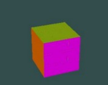
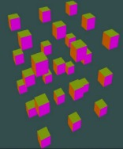
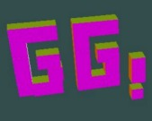
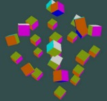

# Cubo de Rubik con OpenGL

## Introducción

El objetivo de este proyecto es implementar un cubo de Rubik utilizando OpenGL. El cubo de Rubik es un famoso rompecabezas tridimensional que consiste en un cubo compuesto por varias piezas móviles. Cada pieza tiene un color y el objetivo del juego es resolver el cubo girando las diferentes capas para que cada cara del cubo tenga un solo color.

## Características del proyecto

- Utiliza la biblioteca GLM Graphics para manejar la representación gráfica en 3D del cubo.
- Utiliza GLFW para crear la ventana de la aplicación.
- Utiliza las estructuras "Cube" y "Rubik" para representar las piezas individuales y el cubo de Rubik en su conjunto.
- Permite girar las capas del cubo en respuesta a los movimientos del usuario.
- Implementa animaciones suaves para mejorar la experiencia visual.
- Proporciona una simulación de efecto de respiración y animación en el cubo de Rubik.

## Estructura del proyecto

### Rubik.cpp

- `Rubik::Rubik()`: Constructor de la estructura Rubik que inicializa el cubo de Rubik, generando los centros de los cubos, los índices y los colores de las capas del cubo.

- `Rubik::TransformBloques()`: Aplica una transformación a un conjunto de cubos específicos según un tipo de operación.

- `Rubik::cambiarCentros()`: Cambia los centros de los cubos en el objeto Rubik, generando nuevos centros en un patrón específico.

- `Rubik::TransformAnimado()`: Realiza una transformación animada en un conjunto de cubos específicos según un tipo de operación y una lista de pares que indica qué cubos de la capa deben ser transformados.

- `Rubik::Transform()`: Aplica una transformación a todos los cubos en el objeto Rubik según un tipo de operación.

- `Rubik::GenEbo()`: Genera un vector de índices que se utiliza para renderizar los cubos.

- `Rubik::PushVector()`: Agrega elementos de un vector B a otro vector A.

- `Rubik::GenCentrosCubos()`: Genera los centros de los cubos en el objeto Rubik.

- `Rubik::GenIndicesCamadas()`: Genera los índices de las diferentes capas del cubo de Rubik.

- `Rubik::animacionAtomo()`: Realiza una animación del átomo en el cubo de Rubik.

### main.cpp

- Funciones y estructuras necesarias para la inicialización y renderizado de la ventana de la aplicación.

## Ejecución del proyecto

1. Clona el repositorio en tu máquina local.
2. Compila el proyecto utilizando el compilador de C++.
3. Ejecuta el archivo ejecutable generado.
4. Interactúa con la aplicación para girar las capas del cubo de Rubik y resolverlo.

## Requisitos del sistema

- Sistema operativo: Ubuntu (versión XX.XX.XX o superior).
- Compilador de C++ (versión X.X.X o superior).
- Bibliotecas OpenGL, GLM y GLFW instaladas.

## Contribuir

Si deseascontribuir al proyecto, puedes seguir los siguientes pasos:

1. Realiza un fork de este repositorio en tu cuenta de GitHub.
2. Crea una rama nueva para trabajar en tu mejora o corrección.
3. Realiza los cambios necesarios en tu rama.
4. Realiza commits y push de tus cambios a tu repositorio en GitHub.
5. Crea un pull request para que revisemos tus cambios y los incorporemos al proyecto principal.

Agradecemos cualquier contribución al proyecto, ya sea en forma de correcciones de errores, mejoras de funcionalidad o nuevas características.
## Imagenes 

---
#Integrantes:
Carlos Morales Umasi, Christian Ocola Pinto, Aarón Blanco Ramirez.

¡Espero que este README.md mejorado sea útil para tu proyecto! Recuerda personalizarlo según tus necesidades y agregar cualquier información adicional que consideres relevante. ¡Buena suerte con tu proyecto de Cubo de Rubik con OpenGL!
